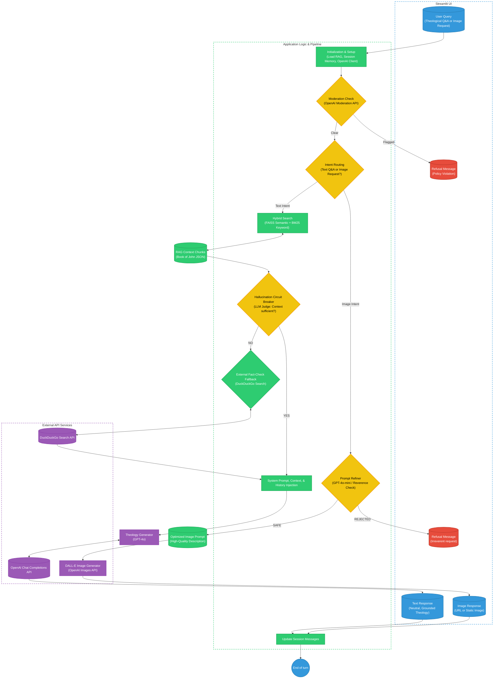

# Christianity-Focused AI Assistant

## Introduction
The Christianity-Focused AI Assistant is a robust, defensively engineered conversational application designed to answer theological questions and generate reverent, Biblical imagery. 

Unlike standard conversational agents, this application prioritizes factual grounding and safety. It is built to strictly prevent LLM hallucinations, handle fake or anachronistic Bible verses gracefully, and maintain denominational neutrality when discussing debated theological concepts. It utilizes a custom Hybrid Search Retrieval-Augmented Generation (RAG) pipeline backed by a deterministic evaluation layer to ensure all text outputs are deeply rooted in actual scripture or historical consensus.

## Application Architecture

The following diagram illustrates the complete data flow, decision routing, and safety mechanisms built into the application.

## Step-by-Step Architecture Flow

### 1. Data Ingestion and Indexing
Upon startup, the application fetches the King James Version (KJV) Bible data in JSON format. To ensure context is never lost during retrieval, the text is split using an overlapping sliding window chunking strategy. These chunks are then embedded into two distinct databases: a FAISS Vector Index (for semantic, meaning-based queries) and a BM25 Index (for exact keyword matching).

### 2. User Input and Moderation Guardrail
When the user submits a prompt, it is immediately passed through the OpenAI Moderation API. This acts as the first line of defense. If the input contains extreme hate speech, self-harm, or severe toxicity, the system forcefully terminates the process and returns a safety refusal, preventing any backend compute from executing.

### 3. Intent Routing
Once cleared by the moderation layer, the application determines the user's intent. If the prompt contains visual keywords (e.g., "draw," "image," "picture"), it routes to the Image Generation Pipeline. Otherwise, it routes to the Text/Theology Pipeline.

### 4. Image Generation Pipeline
To prevent users from generating subtle adversarial images (e.g., Jesus holding modern weapons), the prompt hits a Prompt Refiner. A lightweight LLM (GPT-4o-mini) acts as a safety filter. If the request violates Biblical reverence, it outputs a rejection. If it is safe, the LLM enriches the prompt for maximum visual quality and passes it to the DALL-E API for generation.

### 5. Hybrid Search Retrieval (Text)
For theological questions, the system executes a Hybrid Search. It queries the FAISS vector database and the BM25 keyword index simultaneously, merging the top results and removing duplicates. This ensures the application catches both conceptual themes and specific named entities (like "Nicodemus").

### 6. The Hallucination Circuit Breaker
Instead of blindly passing the retrieved Bible verses to the final generator, the chunks are intercepted by a deterministic Circuit Breaker. An LLM judge evaluates the user's query against the retrieved text. If the user asks about a fake verse (e.g., "Hezekiah 3:12"), the text will not contain the answer, and the Circuit Breaker outputs a strict "NO."

### 7. External Fact-Check Fallback
If the Circuit Breaker trips, the application recognizes that the query falls outside Biblical scripture. It automatically triggers a DuckDuckGo web search to scrape the top historical or theological fact-checking websites. This allows the AI to explicitly debunk myths rather than guessing.

### 8. Final Generation and Session Memory
Finally, the validated context (either Biblical scripture or web fact-checks) is combined with the user's query, the conversation history (stored in Streamlit session state), and a strict System Prompt. The final generator (GPT-4o) synthesizes this data to produce an accurate, denominationally neutral response with exact chapter and verse citations.

## Resources Used

* **Streamlit:** Front-end framework for the conversational UI and session state memory management.
* **OpenAI API:** * `text-embedding-3-small` for vector search.
  * `gpt-4o-mini` for the prompt refiner and circuit breaker evaluation.
  * `gpt-4o` for final text generation.
  * `dall-e-2` / `dall-e-3` for image generation.
  * `moderations` endpoint for top-level safety checks.
* **FAISS (faiss-cpu):** For lightning-fast semantic vector search.
* **Rank-BM25:** For exact-keyword scoring and sparse retrieval.
* **DuckDuckGo-Search:** For dynamic web-scraping to fact-check anachronistic or fake claims.
* **Mermaid.js:** For native markdown architecture diagrams.
* **Python-dotenv:** For secure local API key management.
